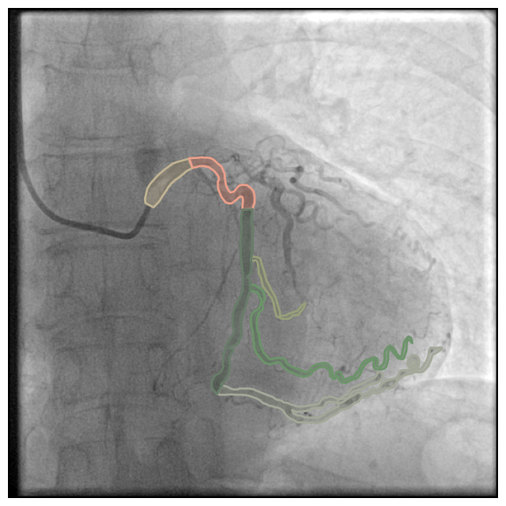
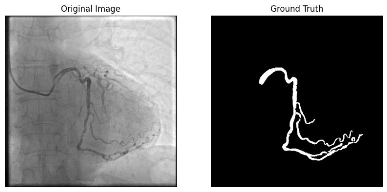
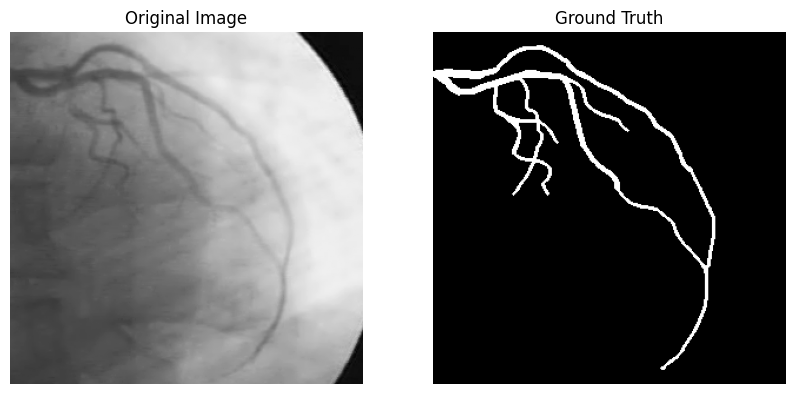
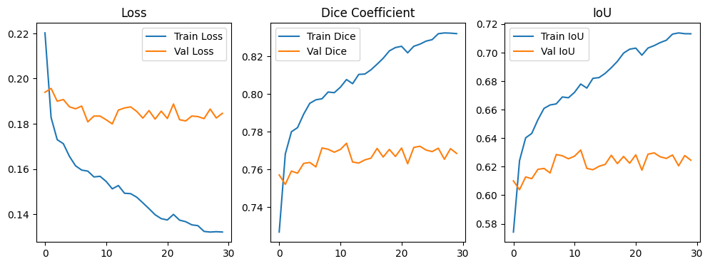
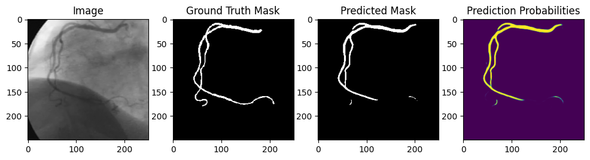
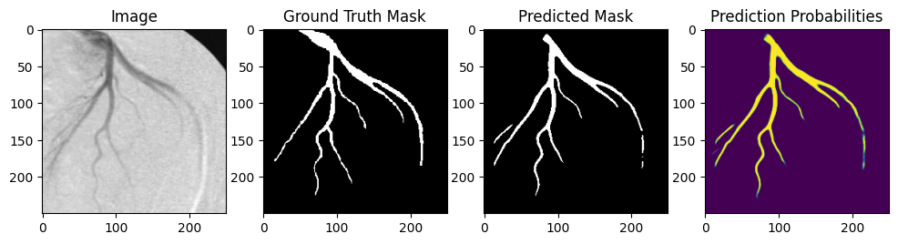
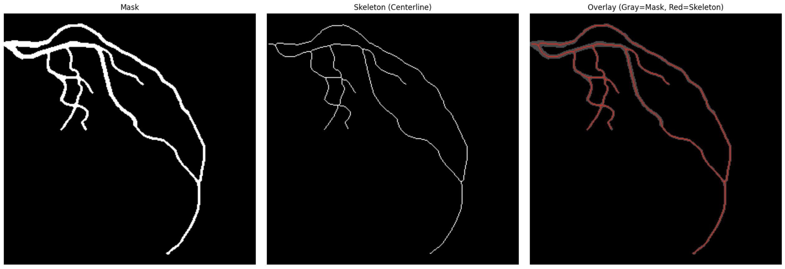
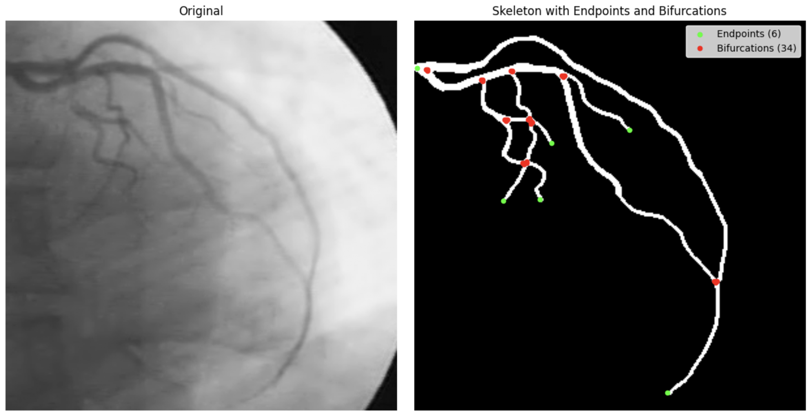

# Segmentacja
## Ładowanie danych
Przy pomocy biblioteki pytorch stworzyliśmy klasy `DataLoader` dla zbiorów DCA1 i podzbioru SYNTAX z ARCADE.

### ARCADE Syntax
Ze względu na małą ilość obrazków danych w DCA1 zdecydowaliśmy się wykorzystać zbiór ARCADE Syntax jako pretreinging dla segmentacji.
<figure>
  
    <figcaption>
        <center>
        Przykładowy obraz z labelką dla ARCADE Syntax
        </center>
    </figcaption>
</figure>

Jak widać na obrazku powyżej zbiór zawiera maski jako segmentacje odcinków naczyń ze względu na SYNTAX score odcinków, więc połączyliśmy te maski dostając zbinaryzowaną maskę segmentującą fragment naczyń zawartych na obrazku, dostając pary obraz - maska jak poniżej.




### DCA1
Podzieliliśmy zbiór DCA1 na zbiór treningowy i testowy w stosunku 75/25, a następnie stworzyliśmy `DataLoader` dla obu tych zbiorów. Poniżej znajduje się przykładowy obraz z DCA1 wraz z odpowiadającą mu maską segmentującą odcinek naczynia.

<figure>
  
    <figcaption>
        <center>
        Przykładowy obraz z labelką dla DCA1
        </center>
    </figcaption>
</figure>

Jak widać zbiór DCA1 dostarcza dokładniejsze maski dlatego jest on docelowym zbiorem dla treningu modelu segmentacji.

## Augmentacja danych
Zdecydowaliśmy się na wykorzystanie biblioteki `albumentations` do augmentacji danych. Nasza augmentacja jest dosyć agresywna i zawiera:

* Resize - zmiana rozmiaru obrazka do 250x250
* HorizontalFlip - odbicie lustrzane w poziomie
* VerticalFlip - odbicie lustrzane w pionie
* Affine - losowe przesunięcie, skalowanie i rotacja obrazka
* RandomBrightnessContrast - losowa zmiana jasności i kontrastu
* CLAHE - adaptacyjne wyrównywanie histogramu
* GaussianBlur - rozmycie gaussowskie
* MotionBlur - rozmycie ruchowe
* GaussNoise - dodanie szumu gaussowskiego

## Trening

Zdecydowaliśmy się wykorzystać model UNet z biblioteki `segmentation_models_pytorch` jako bazowy benchmark dla segmentacji. Wybraliśmy pretrenowane wagi dla enkodera z modelu `resnet34` pretrenowanych na zbiorze ImageNet.

Funkcja straty której użyliśmy to połączenie `BCEWithLogitsLoss` i `DiceLoss` z biblioteki `segmentation_models_pytorch`. Optymalizatorem jest `Adam` z domyślnymi parametrami.

```py
class BCEDiceCriterion(nn.Module):
    def __init__(self, bce_weight: float = 0.5, dice_weight: float = 0.5):
        super().__init__()
        self.bce_weight = bce_weight
        self.dice_weight = dice_weight
        self.bce = nn.BCEWithLogitsLoss()
        self.dice = smp_losses.DiceLoss(mode="binary", from_logits=True)

    def forward(self, logits: torch.Tensor, masks: torch.Tensor) -> torch.Tensor:
        bce_loss = self.bce(logits, masks)
        dice_loss = self.dice(logits, masks)
        return self.bce_weight * bce_loss + self.dice_weight * dice_loss
```

Trening modelu przeprowadziliśmy w dwóch etapach.
* Pretrening na zbiorze ARCADE Syntax przez 50 epok.
* Finetuning na zbiorze DCA1 przez 30 epok.

Poniżej metryki z drugiej fazy treningu na zbiorze DCA1. Widać spory problem z overfittingiem i tak naprawdę model nie nauczył się zbyt wiele.



Poniżej przykładowe predykcje modelu na zbiorze testowym DCA1. Największym problemem w naszym przypadku jest fakt, że segmentacja momentami traci ciągłość, co jest kluczowe w następnych etapach.




Ostatecznie otrzymaliśmy średnie wartości metryk na zbiorze walidacyjnym DCA1:
* Loss: 0.1846
* Dice Coefficient: 0.7685
* IoU: 0.6245

## Co dalej?
Spróbujemy wykorzystać inne architektury takie jak UNet++ czy DeepLabV3 lub modele z własnym, czystym enkoderem. Dodatkowo spróbujemy różnych funkcji strat. Na pewno musimy też wykorzystać walidację skrośną aby wykorzystać lepiej mały zbiór DCA1. Musimy również wykorzystać narzędzia do optymalizacji hiperparametrów takie jak `Optuna` aby dostosować parametry metryk i modeli.

# Proof of concept tworzenia grafu naczyń
Zaczęliśmy także wczesne prace nad tworzeniem skryptu do tworzenia grafu naczyń z segmentacji. Na razie testujemy klasyczny deterministyczny algorytm skeletonizacji wykorzystujący operacje morfologiczne. Na razie do testów wykorzystujemy maski z DCA1, jako, że nasza segmentacja nie jest jeszcze idealna.

Przykładowy wynik naszej szkieletyzacji dla jednego z obrazków DCA1 wygląda następująco:



Istotnym problemem okazuje się detekcja węzłów. Problem wynika z faktu, że obrazy są rzutem trójwymiarowej struktury naczyniowej na dwuwymiarową płaszczyznę. W miejscach, gdzie dwa naczynia przebiegają blisko siebie lub się krzyżują, ich segmentacje mogą się nachodzić, tworząc na masce binarnej kształt łudząco podobny do prawdziwego rozgałęzienia. Algorytm szkieletyzacji oparty na operacjach morfologicznych nie jest w stanie odróżnić faktycznej bifurkacji od takiego artefaktu nakładania, co prowadzi do fałszywych węzłów w grafie naczyniowym.

W następnym etapie postaramy się zastosować inne podejścia porównując ich skuteczność w detekcji bifurkacji naczyń. 


