# Raport cząstkowy

# Cel projektu

Celem projektu jest przygotowanie narzędzia, które z obrazu angiografii wieńcowej wyznacza strukturę naczyń, opisuje ją geometrycznie i na tej podstawie wskazuje miejsca potencjalnych zmian. Samo narzędzie zaplanowaliśmy jako wiele kroków przetwarzania, które po kolei prowadzą do ostatecznej analizy zmian.

# Plan realizacji

Najpierw obraz jest normalizowany i przekazywany do modelu segmentacyjnego. Model zwraca maskę naczyń. Następnie maska jest czyszczona, szkieletyzowana i zamieniana na graf. Z grafu wyliczane są cechy geometryczne. Ostatni etap ma rozpoznawać zmiany na podstawie tych cech oraz generować raport z wynikiem.

1. segmentacja naczyń,
2. czyszczenie maski,
3. szkieletyzacja,
4. wykrywanie i klasyfikacja bifurkacji,
5. ekstrakcja cech z gałęzi,
6. rozpoznawanie zmian,
7. wygenerowanie raportu.

# Dane

Do treningu modeli wykorzystaliśmy kilka zbiorów danych. Jako podstawowy zbiór do segmentacji, posłużył nam DCA1, czyli baza 134 angiogramów wieńcowych z ręcznie oznaczonymi maskami naczyń [2].  Istotną wadą tego zbioru jest jego liczność, przez co nie mogliśmy znacząco dopracować segmentacji.

Wspomogliśmy się też zbiorem danych FS-CAD [3], który zawiera dodatkowe 40 masek angiograficznych.

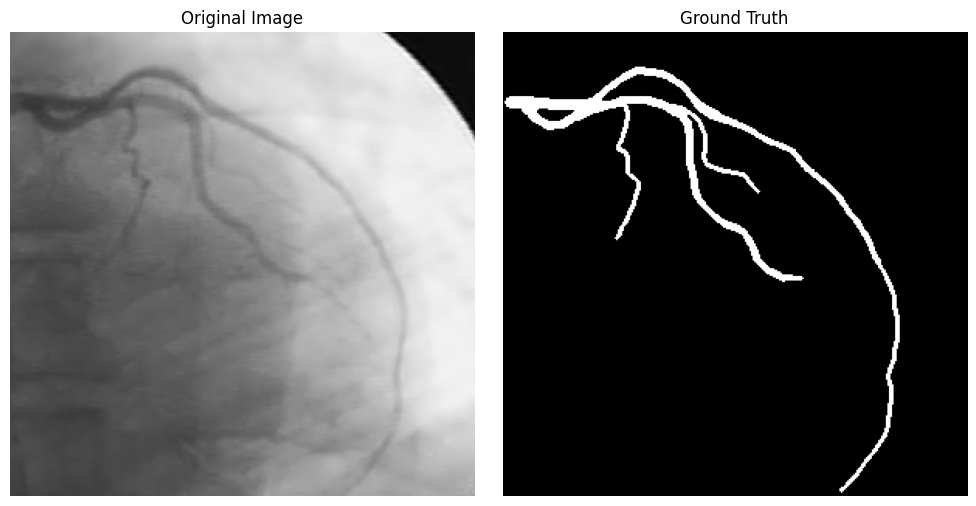

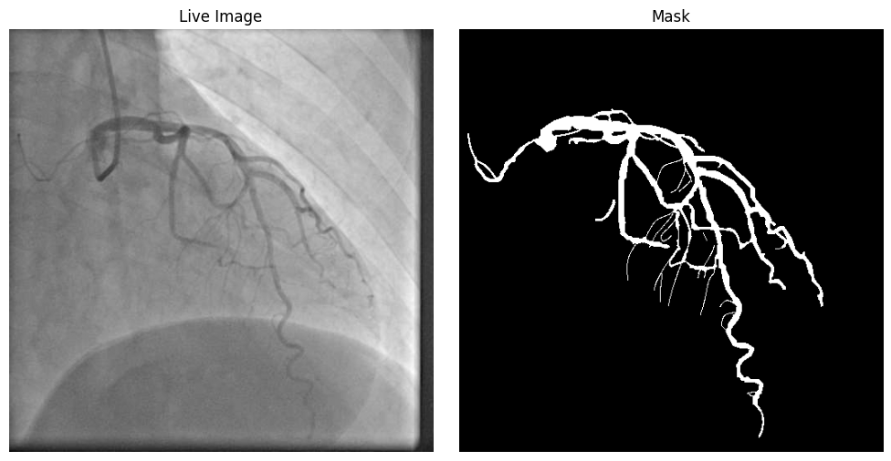

Dla poprawy wyników wykorzystaliśmy też pretrening modelu segmentacyjnego na zbiorze ARCADE Syntax [1]. Zbiór ten nie zapewnia co prawda dokładnych masek, 
ale zawiera adnotacje fragmentów naczyń podzielone na różny wynik SYNTAX Score. Zbinaryzowaliśmy te adnotacje, tworząc zgrubsze maski potrafiące nauczyć 
model podstawowej struktury naczyń.

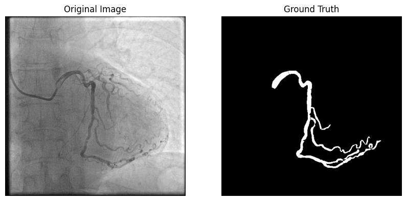

Do dalszej detekcji zmian wykorzystujemy też ARCADE stenosis, ponieważ zawiera adnotacje miejsc zwężeń [1]. W notebooku `datasets.ipynb` przykładowa adnotacja jest ładowana z formatu COCO.

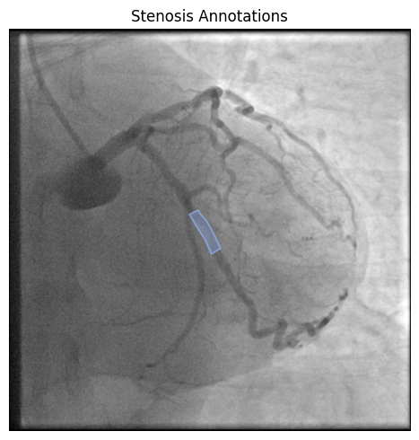

# Segmentacja

Pierwsze eksperymenty z segmentacją wypadały niezadowalająco z DICE na poziomie `0.75`. Największym problemem była duża fragmentacja maski segmentacyjnej, więc zdecydowaliśmy się na tuning hiperparametrów przy użyciu biblioteki `optuna`. Dzięki automatycznemu przeszukiwaniu przestrzeni hiperparametrów przez Optunę udało się podnieść DICE z początkowych 0.75 do 0.81 na zbiorze walidacyjnym, bez ręcznego dobierania konfiguracji treningowej.

Segmentację trenowaliśmy na kilku wariantach modeli, między innymi `U-Net`, `U-Net++` i `DeepLabV3+`.

Najlepszy wynik na zbiorze walidacyjnym uzyskał model `U-Net++`, trenowany na obrazach `256 x 256`, z optymalizatorem `AdamW` i schedulerem `ReduceLROnPlateau` - `dice=0.81`.

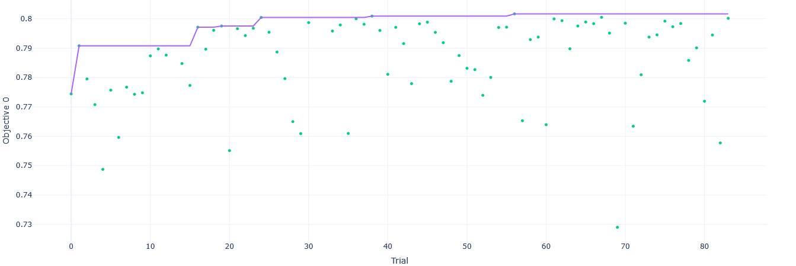

Uznaliśmy, że obecny efekt jest wystarczający, biorąc pod uwagę jak niewielki zbiór danych mieliśmy do dyspozycji. Próbowaliśmy też stosować większe modele, ale one z kolei bardzo szybko przeuczały.

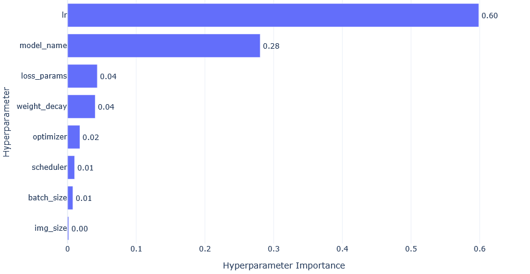

Najlepszy model na danych testowych - które nie były użyte ani do treningu, ani do tuningu hiperparametrów - uzyskał wyniki:

* Test Dice: `0.7924`
* Test IoU: `0.6563`
* Test Loss: `0.1489`

Do częściowego rozwiązania problemu z ciągłością maski segmentacji zastosowaliśmy loss w postaci połączenia binarnej entropii krzyżowej i metryki `clDICE`, która na podstawie szkieletyzacji określa spójność segmentacji.

Poniżej przykładowy wynik segmentacji ze zbioru testowego.
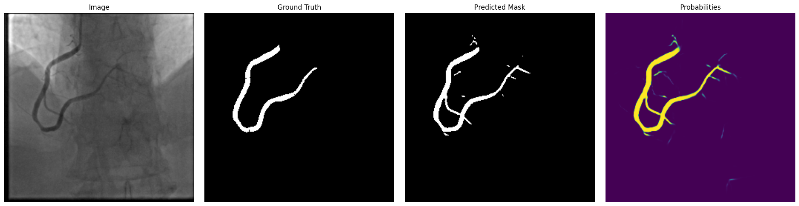

# Szkieletyzacja

Szkieletyzacja zamienia maskę naczynia na linię centralną. Jest to kluczowy etap, bo pozwala przejść z obrazu pikselowego do struktury, którą można analizować jak graf.

Poniżej znajduje się przykład wejścia do tego etapu. Po lewej jest obraz angiograficzny, a po prawej odpowiadająca mu maska.

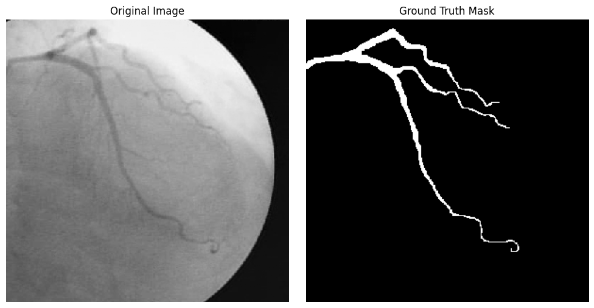

Po oczyszczeniu maski wykonywana jest szkieletyzacja. Czerwona linia pokazuje wyznaczoną linię centralną naczynia.

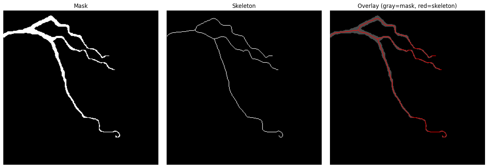

Sam proces szkieletyzacji generuje też krótkie, niepożądane odnogi. Część z nich powstaje przez drobne nierówności maski. Dlatego dodaliśmy pruning krótkich fragmentów.

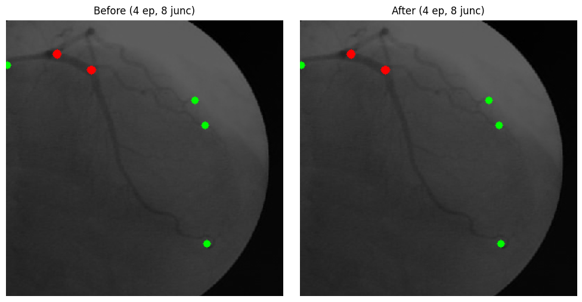

Po pruningu dla analizowanego przykładu otrzymaliśmy graf z pięcioma gałęziami.

| Metryka | Wartość |
|---|---:|
| Całkowita długość naczyń | 753.6 px |
| Najdłuższa gałąź | 284.9 px |
| Najkrótsza gałąź | 44.6 px |
| Liczba gałęzi | 5 |
| Średnia krętość | 1.181 |

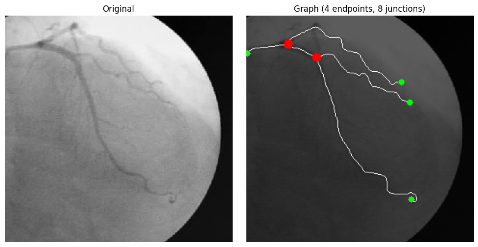

Z grafu można również wyznaczać lokalną średnicę. Obecnie robimy to przez distance transform maski. Dla każdego punktu skeletonu bierzemy odległość do brzegu maski i traktujemy podwojoną wartość jako przybliżoną średnicę.

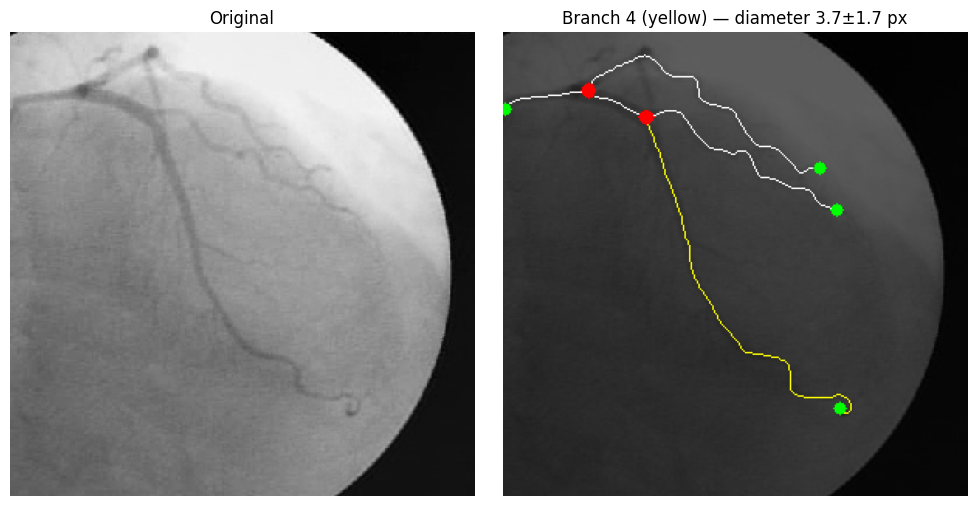

Ta informacja jest szczególnie ważna dla dalszej detekcji stenoz. Zwężenie powinno być widoczne nie tylko jako lokalny wzorzec obrazu, ale też jako zmiana profilu średnicy wzdłuż gałęzi.

# Wykrywanie bifurkacji

Wykrywanie bifurkacji jest jednym z trudniejszych wyzwań w tym projekcie, ponieważ w obrazie 2D naczynia mogą się nakładać. W masce takie miejsce może wyglądać jak prawdziwe rozgałęzienie, mimo że jest tylko przecięciem projekcji.

Dlatego dodaliśmy mechanizm klasyfikacji węzłów rozgałęzień. Każde podejrzane miejsce jest przypisywane do jednej z trzech grup:

* `certain`, czyli prawdopodobna prawdziwa bifurkacja,
* `false`, czyli prawdopodobne fałszywe rozgałęzienie,
* `not`, czyli brak pewnej decyzji.

Klasyfikacja korzysta z ramion wychodzących z danego rozgałęzienia. Jeżeli ramiona dobrze układają się w kontynuację jednego naczynia, punkt może zostać uznany za fałszywy. Jeżeli układ ramion wygląda jak rzeczywiste rozgałęzienie, punkt zostaje oznaczony jako `certain`.

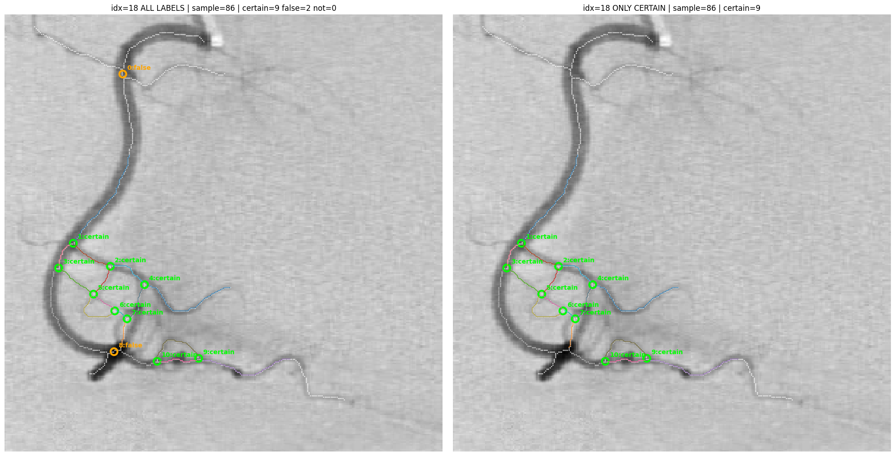

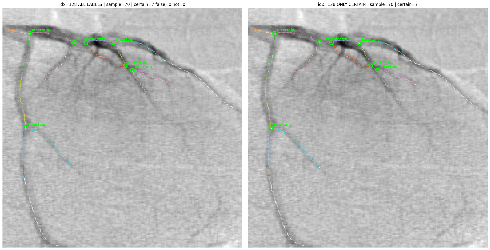

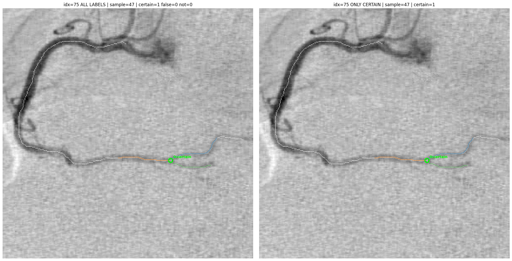

Dla zestawu 10 losowych próbek ze zbioru DCA1 otrzymaliśmy:

| sample_id | certain | false | not | total |
|---:|---:|---:|---:|---:|
| 86 | 9 | 2 | 0 | 11 |
| 118 | 3 | 1 | 0 | 4 |
| 102 | 4 | 0 | 0 | 4 |
| 58 | 4 | 0 | 0 | 4 |
| 70 | 7 | 0 | 0 | 7 |
| 53 | 6 | 1 | 0 | 7 |
| 21 | 3 | 1 | 0 | 4 |
| 4 | 1 | 0 | 0 | 1 |
| 84 | 3 | 0 | 0 | 3 |
| 47 | 1 | 0 | 0 | 1 |

Łącznie wykryto 46 grup junctionów. Z tego 41 oznaczono jako `certain`, 5 jako `false`, a żadnej jako `not`.

Wizualnie wyniki są sensowne, ale nadal jest to ocena jakościowa. Nie mamy jeszcze ręcznie oznaczonego zbioru prawdziwych i fałszywych bifurkacji. Z tego powodu nie można uczciwie podać precision ani recall dla tego etapu.

# Klasyfikacja zmian naczyniowych

Samej klasyfikacji zmian dokonujemy na podstawie grafu z poprzedniego etapu. Dzielimy graf na odcinki, i tworzymy rekordy tabelaryczne opisujące średnicę naczynia na danych odcinkach fragmentu grafu.

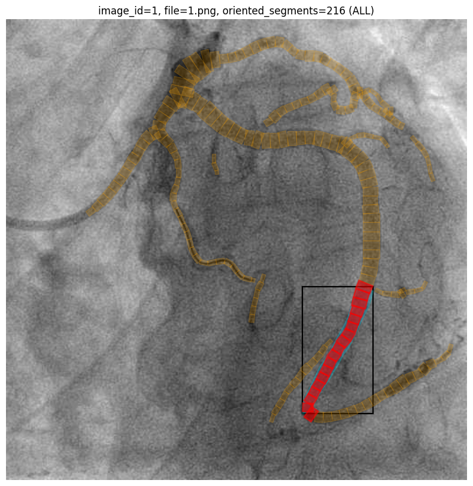

Następnie dane tabelaryczne klasyfikujemy modelem `XGBoost`. Obecnie przeprowadziliśmy dopiero pierwsze eksperymenty i jakość modelu nie jest jeszcze zadowalająca.

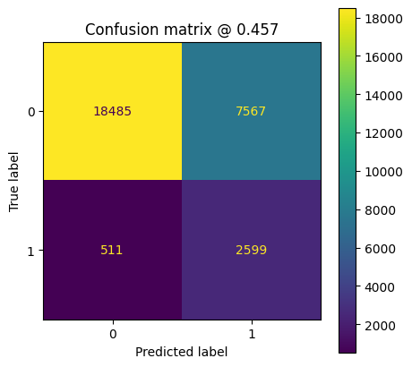

W danych tabelarycznych zapisujemy poniższe cechy:
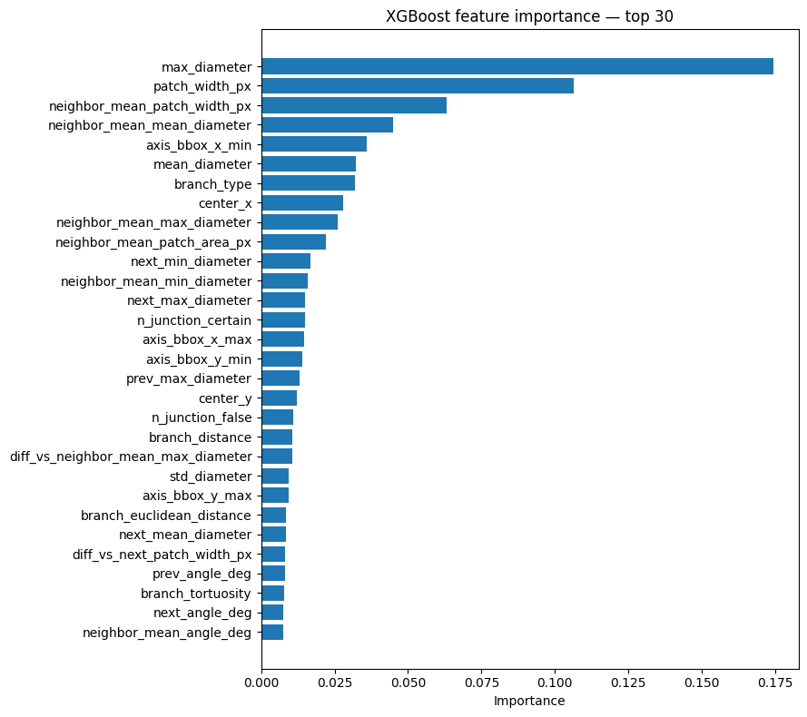

Poniżej przykład klasyfikacji odcinka:
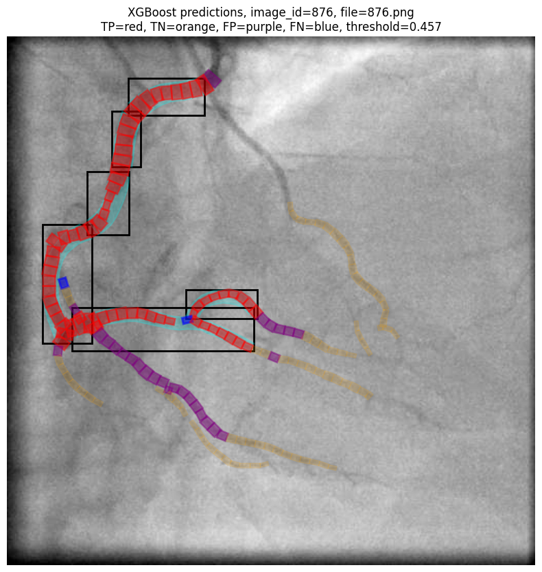

# Generowanie raportu

Powstał też moduł generowania raportu z pojedynczej analizy. Raport zapisuje obraz wejściowy, maskę segmentacji, graf naczyń oraz tabele z cechami topologicznymi.

W raporcie mogą znaleźć się między innymi:

* całkowita długość naczyń,
* liczba gałęzi,
* długości gałęzi,
* średnie, minimalne i maksymalne średnice,
* liczba wykrytych bifurkacji jak i ich klasyfikacja

Jedynym brakującym elementem jest wpięcie modułu klasyfikującego zmiany miażdżycowe do procesu generowania raportu. 

# Bibliografia

[1] ARCADE: Dataset for Automatic Region-based Coronary Artery Disease Diagnostics Using X-Ray Angiography Images, Scientific Data, 2023. https://www.nature.com/articles/s41597-023-02871-z

[2] DCA1: Database X-ray Coronary Angiograms. http://personal.cimat.mx:8181/~ivan.cruz/DB_Angiograms.html

[3] Zeng et al., Pretrained subtraction and segmentation model for coronary angiograms, Scientific Reports, 2024. https://www.nature.com/articles/s41598-024-71063-5
