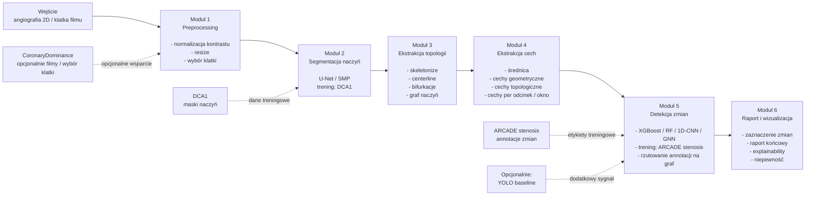

# Plan implementacji projektu
Planujemy podzielić pipeline na 6 modułów, każdy ze swoim wyspecjalizowanym zadaniem.

## Moduł 1 - preprocessing
Moduł odpowiada za normalizację obrazów wejściowych. Typowa transformacja danych wejściowych dla sieci neuronowych. Zastosujemy jakieś proste operacje typu:
- normalizacja kontrastu
- resize obrazu
- wybór klatki filmu, jeśli dodamy wsparcie filmów na wejściu jak np w datasecie CoronaryDominance

## Moduł 2 - segmentacja
Wykorzystamy sieć z rodziny U-Net do segmentacji naczyń. Nauczymy tą sieć na obrazkach ze zbioru DCA1, ze względu na dobre i dokładne maski. Docelowo pewnie wezmiemy jakiś pretrenowany U-Net z `segmentation_models_pytorch` i zrobimy fine-tuning. Spróbujemy także wykorzystać zbiór `syntax`
z `ARCADE`, żeby powiększyć zbiór na którym trenujemy nasz model - DCA1 jest bardzo małe.

## Moduł 3 - ekstrakcją topologii
Na podstawie maski segmentacji naczyń, za pomocą operacji morfologicznych jak np `skeletonize`, stworzymy graf naczyń widocznych na masce. Spróbujemy wykryć w ten sposób linię środkową naczyń (`centerline`) i rozwidlenia naczyń

## Moduł 4 - ekstrakcja cech
Ponownie na podstawie deterministycznych przekształceń segmentacji i uzyskanego grafu, zbierzemy dane odnosnie średnicy i jawnych cech geometrycznych oraz topologicznych naczyń w każdym odcinku.

## Moduł 5 - detekcja zmian
Moduł będzie właściwym modelem wykrywającym zmiany miażdżycowe. Do treningu wykorzystamy dataset `ARCADE/stensosis`. Na start możemy użyć prostych klasyfikatorów typu `XGBoost` działających na oknach, segmentach grafu - jako label wziąć przerobioną etykietę z `ARCADE/stenosis`. Trening wyglądałby mniej więcej tak, że bierzemy obrazek z `arcade`, przepuszamy przez pipeline, i puszczamy klasyfikator na segmentach "oknach" grafu, i na podstawie wynikowej annotacji z `arcade` rzutujemy ją na oczekiwany odcinek i sprawdzamy czy w tym obszarze powinniśmy wykrywać zmianę czy nie.

Możemy tutaj później testować bardziej skomplikowane modele, typu `1D-CNN` czy bardziej skomplikowane GNN. Można też dodać równolegle fine-tuneowany model `YOLO` który robiłby wszystko od początku na obrazie samemu i na podstawie dwóch modeli łączyć tutaj informację - jednak to jest opcjonalne.

## Moduł 6 - generowanie raportu
Moduł zaznaczający podejrzane obszary na obrazie i generujący ostateczny raport. Dodatkowo można spróbować dodać jakieś algorytmy próbujące wyjaśnić decyzję modelu - `SHAP`, `LIME` dla danych tabelarycznych czy wizualizacja gradientów dla `CNN`. Dodatkowo chcielibyśmy tutaj zaimplementować jakąś miarę niepewności.
